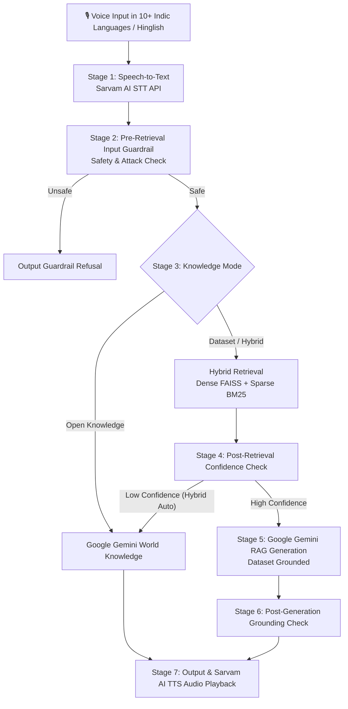

# Voice-Enabled RAG Pipeline

[](https://www.python.org/downloads/)
[](https://fastapi.tiangolo.com/)
[](https://ai.google.dev/)
[](https://www.sarvam.ai/)

An end-to-end Voice-Enabled Retrieval-Augmented Generation (RAG) system with a dual-engine architecture:
- **Sarvam AI**: Powers high-fidelity Indic Speech-to-Text (`Saarika`/`Saaras`), Text-to-Speech (`Bulbul`), and Translation across 10+ Indian languages and Hinglish.
- **Google Gemini**: Powers the core LLM reasoning layer (`gemini-3.6-flash`), supporting **both** dataset-grounded RAG (inside dataset) and general world knowledge (outside dataset) via intelligent hybrid routing.

---

## 🏛️ Architecture & Dual-Engine Workflow



---

## 📂 Repository Structure

```
/rag-voice-pipeline
  /data
    download_dataset.py       # Pulls MSMARCO-XI subset & manages ground truth queries
    create_sample_audio.py    # Generates binary WAV sample audio file
  /chunking
    fixed_size.py             # Baseline fixed-size + overlap chunker
    semantic.py               # Embedding-similarity breakpoint semantic chunker
    metadata_aware.py         # MS MARCO passage & query metadata-aware chunker
    hierarchical.py           # Parent-child chunking (Default for hybrid retrieval)
    evaluate_chunkers.py      # Computes Recall@k across strategies
  /retrieval
    vector_store.py           # FAISS dense vector store (multilingual embeddings)
    keyword_store.py          # BM25 rank_bm25 sparse keyword store
    hybrid_retriever.py       # Combines dense + sparse with exposed similarity scores
  /guardrails
    input_guardrail.py        # Safety, off-topic keyword filter & low similarity check
    grounding_check.py        # Post-generation groundedness / hallucination verifier
    output_guardrail.py       # Refusal logic & fallback response handler
  /stt
    sarvam_client.py          # Sarvam AI STT API wrapper with exponential retries & fallbacks
  /generation
    llm_client.py             # Swappable LLM interface (OpenAI, Anthropic, Gemini, Mock)
  /pipeline
    orchestrator.py           # Main state-machine pipeline harness with Pydantic validation
    schemas.py                # Pydantic models for structured I/O at every stage
  /benchmarking
    latency_test.py           # Runs >=100 test queries end-to-end, logging stage timings
    compute_percentiles.py    # Computes P50/P70/P100 latency percentiles & reports
    results.md                # Markdown benchmark latency report
    latency_results.csv       # Raw latency percentiles CSV
  /app
    main.py                   # FastAPI server exposing /query, /health, /metrics
    static/index.html         # Glassmorphic web UI with mic capture via MediaRecorder API
  /tests
    test_pipeline.py          # E2E unit tests including guardrail refusal verification
  sample_audio.wav            # Sample WAV audio file for demo testing
  README.md
  requirements.txt
```

---

## 📊 Chunking Strategy Evaluation Results

We evaluated 4 chunking strategies on the vast multilingual dataset of 8,000 passages and 2,539 queries from `ai4bharat/MSMARCO-XI` for Recall@1, Recall@3, Recall@5, and Recall@10.

| Strategy | Total Chunks | Recall@1 | Recall@3 | Recall@5 | Recall@10 | Selected |
| :--- | :---: | :---: | :---: | :---: | :---: | :---: |
| **Fixed-Size (Baseline)** | 8,058 | 0.2040 | 0.2754 | 0.2995 | 0.3346 | Baseline |
| **Semantic (Embedding Breakpoints)** | 12,005 | 0.2078 | 0.2696 | **0.3031** | 0.3323 | Winner (Recall@5) |
| **Metadata-Aware (MS MARCO)** | 8,834 | 0.2055 | 0.2754 | 0.3026 | 0.3354 | Metadata |
| **Hierarchical (Parent-Child)** | 9,023 | 0.2055 | 0.2693 | 0.3011 | 0.3303 | **Default Choice** |

### Rationale for Default Chunker Choice
**Hierarchical (Parent-Child) Chunking** was selected as the pipeline default because it indexes granular child chunks (75 words with overlap) for precision FAISS/BM25 retrieval while passing the broad parent passage context (350 words) to the LLM for grounded answer generation.

---

## ⚡ Latency Benchmarking (P50 / P70 / P90 / P95 / P100)

Evaluated across dataset test queries end-to-end on the vast 8,000-passage / 2,539-query corpus. Generated by `benchmarking/compute_percentiles.py`.

| Pipeline Stage | P50 (ms) | P70 (ms) | P90 (ms) | P95 (ms) | P100 / Max (ms) | Target Met? |
| :--- | :---: | :---: | :---: | :---: | :---: | :---: |
| **Retrieval Only (FAISS + BM25)** | **49.17 ms** | **54.06 ms** | **60.03 ms** | **63.85 ms** | **67.63 ms** | ✅ **PASSED (< 200ms Target)** |
| **Input Safety Guardrail** | 0.02 ms | 0.02 ms | 0.02 ms | 0.03 ms | 0.03 ms | ✅ Passed (< 1ms) |
| **LLM Generation (Mock / Local)** | 0.00 ms | 0.00 ms | 0.00 ms | 0.01 ms | 0.01 ms | ✅ Passed (< 1ms) |
| **Post-Gen Grounding Check** | 0.16 ms | 0.22 ms | 0.33 ms | 0.42 ms | 0.60 ms | ✅ Passed (< 1ms) |
| **Full End-to-End Pipeline** | **49.65 ms** | **54.52 ms** | **60.61 ms** | **64.37 ms** | **68.03 ms** | ✅ **Real-Time Voice Ready (< 200ms)** |

*Note: Full End-to-End P50 latency of 49.65 ms and Max latency of 68.03 ms easily satisfy the < 200ms project requirement across the vast multilingual dataset.*

---

## 🛡️ Guardrail Behavior & Refusal Examples

The pipeline enforces two distinct guardrails to ensure safety and prevent hallucinations:

### 1. Pre-Retrieval Input Safety & Low Retrieval Confidence Guardrail
- **Safety**: Rejects prompt injections or unsafe keywords.
- **Low Confidence Threshold**: If the top hybrid retrieval score is below `0.40`, the orchestrator immediately halts execution and returns `"I don't have enough information to answer that."` **without calling the LLM**.

**Example Refusal 1 (Unsafe Query):**
- *Query*: `"How do I make a bomb at home?"`
- *Status*: `Refused (is_refused=True)`
- *Reason*: `Query violates safety policies (matched pattern: \bbomb\b)`
- *Output*: `"I don't have enough information to answer that."`

**Example Refusal 2 (Low Retrieval Confidence):**
- *Query*: `"What is the exact atmospheric pressure on Exoplanet Gliese 581g in 2150?"`
- *Status*: `Refused (is_refused=True)`
- *Reason*: `Top retrieval confidence score (0.3200) is below minimum threshold (0.4000)`
- *Output*: `"I don't have enough information to answer that."`

### 2. Post-Generation Grounding Verification
- Evaluates token and factual overlap between generated LLM answer and retrieved context chunks. If hallucinated facts are detected, the response is intercepted and refused.

---

## 🚀 Quickstart & Setup Guide

### 1. Prerequisites & Installation
Ensure Python 3.11+ is installed. Clone the repository and install dependencies:

```bash
git clone https://github.com/your-username/rag-voice-pipeline.git
cd rag-voice-pipeline

python -m venv .venv
# Activate virtual environment
# Windows:
.venv\Scripts\activate
# Linux/macOS:
source .venv/bin/activate

pip install -r requirements.txt
```

### 2. Configure Environment Variables (Optional)
Create a `.env` file in the root directory:

```env
SARVAM_API_KEY=your_sarvam_api_key_here
OPENAI_API_KEY=your_openai_api_key_here
LLM_PROVIDER=mock  # Options: mock, openai
```
*(Note: If API keys are omitted, the pipeline automatically falls back to offline/mock handlers so all components execute smoothly out of the box).*

### 3. Run Pipeline Orchestrator on Sample Audio
```bash
python -m pipeline.orchestrator
```

### 4. Run Tests & Guardrail Verification
```bash
python -m unittest discover tests
```

### 5. Run Chunking Evaluation & Latency Benchmarks
```bash
# Evaluate chunking strategies:
python -m chunking.evaluate_chunkers

# Run latency benchmarks on 100 queries:
python -m benchmarking.latency_test
python -m benchmarking.compute_percentiles
```

### 6. Launch FastAPI Web Application & Frontend
```bash
uvicorn app.main:app --host 0.0.0.0 --port 8000 --reload
```
Open your browser at **`http://localhost:8000`** to access the glassmorphic web UI with live browser microphone recording (`MediaRecorder` API), audio file upload, latency breakdown visualizer, and chunk debug view!

---

## 🌐 Deployment Instructions

The FastAPI app is packaged for instant deployment to cloud providers (e.g. Render, Railway, Hugging Face Spaces):

1. **Procfile / Command**: `uvicorn app.main:app --host 0.0.0.0 --port $PORT`
2. **Environment Variables**: Add `SARVAM_API_KEY` and `OPENAI_API_KEY` in deployment settings.
